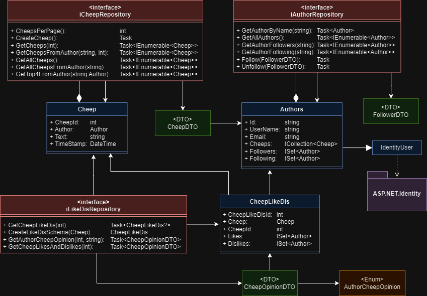
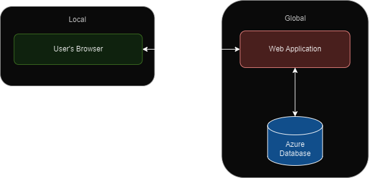
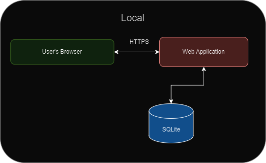
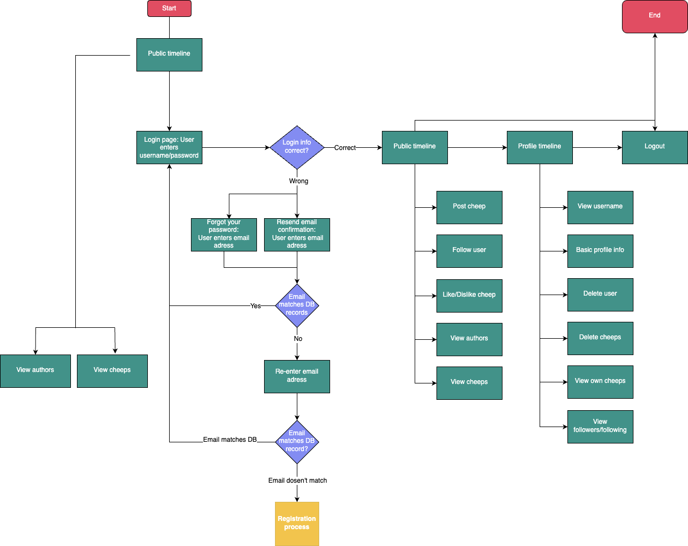
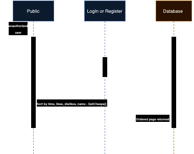
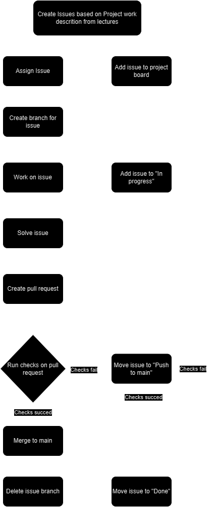

# Design and Architecture of _Chirp!_

## Domain model

## Architecture — In the small
Illustrate the organization of your code base. That is, illustrate which layers exist in your (onion) architecture. Make sure to illustrate which part of your code is residing in which layer.

## Architecture of deployed application

Illustrate the architecture of your deployed application. Remember, you developed a client-server application. Illustrate the server component and to where it is deployed, illustrate a client component, and show how these communicate with each other.

OBS: In case you ran out of credits for hosting an Azure SQL database and you switched back to deploying an application with in-process SQLite database, then do the following:

Under this section, provide two diagrams, one that shows how Chirp! was deployed with hosted database and one that shows how it is now again with SQLite.
Under this section, provide a brief description of the reason for switching again to SQLite as database.
In that description, provide a link to the commit hash in your GitHub repository that points to the latest version of your Chirp! application with hosted database (we look at the entire history of your project, so we see that it was there at some point).

## User activities
Illustrate typical scenarios of a user journey through your Chirp! application. That is, start illustrating the first page that is presented to a non-authorized user, illustrate what a non-authorized user can do with your Chirp! application, and finally illustrate what a user can do after authentication.

Make sure that the illustrations are in line with the actual behavior of your application.

The Chirp! platform initiates user engagement through a publicly available timeline, where non-authenticated visitors can peruse user-generated content. This allows for a preliminary understanding of the platform's community activities. Interested individuals are then guided to either log in, if they are returning users, or to register, should they be new to the community. The registration process is straightforward, requiring standard user information and adherence to password protocols.

Upon successful entry into the community, the user experience becomes personalized. The platform greets users by their chosen names and opens up a suite of interactive possibilities. Users can contribute their own content and engage with others through established social mechanisms. Furthermore, each user has access to a personal dashboard reflecting their activity and interactions within the community. Chirp! also prioritizes user privacy and control, exemplified by the 'Forget Me' feature, which allows users to remove their presence and data from the platform permanently.

## Sequence of functionality/calls through _Chirp!_

Once you enter the landing page, Public, of our Chirp! application an HTTP Get Request is sent to our database and returns all of our cheeps to be displayed. Note that seeing all cheeps is possible for an unauthorized user whereas liking, following, and cheeping is not. To be granted those rights, one must either log in or register a new user which renders the same Public page just with different functionality. Logging in or registering a new account will redirect one to their respective pages. Logging in or registering an account is done by HTTP Post methods either validating the login or registering (i.e. creating a new author) the new account and in both cases, one is redirected to the Public page, now with additional rights.

# Process

## Build, test, release, and deployment
Illustrate with a UML activity diagram how your Chirp! applications are build, tested, released, and deployed. That is, illustrate the flow of activities in your respective GitHub Actions workflows.
Describe the illustration briefly, i.e., how your application is built, tested, released, and deployed.

The CI/CD pipeline for the Chirp application starts with the developer committing code to the main branch or creating a pull request. GitHub Actions are then triggered to execute workflows defined in build_and_testing.yml and main_bdsagroup6chirprazor.yml(deployment).
This ensures that each commit to the main branch undergoes a thorough process of integration, testing, and deployment, thereby maintaining the quality and reliability of the Chirp application with automated processes for efficiency and consistency.

## Team work
Show a screenshot of your project board right before hand-in. Briefly describe which tasks are still unresolved, i.e., which features are missing from your applications or which functionality is incomplete.

### Description: Upon creating a new issue two synchronous timelines start simultaneously, one where the issue is being created, a branch made and the functionality implemented, while the other follow the timeline of the issue’s lifespan on the project board. A part of both timelines are iterative meaning that if our implementation fails or does not live up to the requirements we will begin anew, working continuously until the branch can be successfully merged into main. Then and only then will our issue be moved to ‘Done’ in our project board.

Briefly describe and illustrate the flow of activities that happen from the new creation of an issue (task description), over development, etc. until a feature is finally merged into the main branch of your repository.

## How to make _Chirp!_ work locally
## Chirp! Project Setup Guide

This guide assists new contributors, like Rasmus and Helge, in setting up the Chirp! project locally.

## Cloning the Chirp! Repository

### Install Git
- Ensure Git is installed on your system. 
- Download and install from [git-scm.com](https://git-scm.com/).

## Clone the Repository
- Open a terminal or command prompt.
- Clone the Chirp! repository:
git clone https://github.com/ITU-BDSA23-GROUP6/Chirp.git

## Prerequisites

- **.NET 7 SDK**: Install from [Microsoft's .NET download page](https://dotnet.microsoft.com/en-us/download/dotnet/7.0).
- **IDE**: Use an IDE supporting .NET 7, such as:
- Visual Studio 2022 (with the latest updates)
- Visual Studio Code with C# extension
- JetBrains Rider

## Environment Setup and Configuration

### Open the Project
- Open the cloned directory in your IDE.

### Restore Dependencies
- Run the following command in the terminal or use the IDE’s built-in restore feature:
dotnet restore

### Check Configuration
- Ensure `appsettings.json` in the project root is correctly configured and contains:
"ConnectionStrings": {
    "DefaultConnection": "Server=tcp:bdsagroup6chirpserver.database.windows.net,1433;Initial Catalog=bdsagroup6chirpdb;Persist Security Info=False;User ID=chripadmin;Password=chirpdbPassword;MultipleActiveResultSets=False;Encrypt=True;TrustServerCertificate=False;Connection Timeout=30;"
  },
  "Authentication": {
    "GitHub": {
      "ClientIdAzure": "564f6fd9fd6c86a8ea02",
      "ClientSecretAzure": "GitHub:ClientSecretAzure",
      "ClientIdLocal": "968faf4d2e8bfa8fe03f",
      "ClientSecretLocal": "GitHub:ClientSecretLocal"
    }
  }

## Building and Running the Application

### Build the Project
- Execute the following command in the root directory:
dotnet build

### Run the Application
- Start the application with:
direct to Chirp.Web from the root directory

cd .\src\Chirp.Web\

Then you have two options, running in Delevoper mode (runs sqlite) or production mode (ran on the azure SQL)

Delevoper command: dotnet run -lp Dev
Production command: dotnet run -lp Prod

## Expected Outcome

- The application compiles without errors.
- On running, it should start a local server, check if it has been seeded, if not seed the database and output a URL to access the application (https://5232).

## Troubleshooting Guide

- **Build Errors**: Check for missing NuGet packages or unresolved dependencies. Ensure the .NET 7 SDK is correctly installed.
- **Runtime Errors**: Verify environment variables and `appsettings.json` configurations. Check for database connectivity issues if applicable.
- **IDE-Specific Issues**: Ensure the IDE is configured for .NET 7 development, with the correct SDK paths and extensions/plugins installed.

## How to run test suite locally
List all necessary steps that Rasmus or Helge have to perform to execute your test suites. Here, you can assume that we already cloned your repository in the step above.

Briefly describe what kinds of tests you have in your test suites and what they are testing.

# Ethics

## License
In our group we decided to opt for the MIT license as it is open source, allowing others to freely use the software without providing legal obligations on the software creators thus ensuring that they bear no legal liability in the case of software malfunctioning, data loss, etc.

## LLMs, ChatGPT, CoPilot, and others
